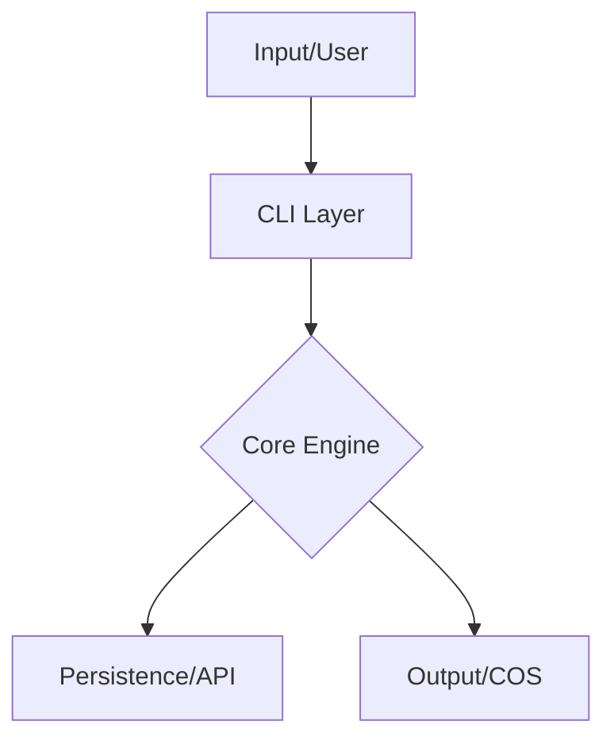

# Climon Design Document Standard (CDDS)

**Version:** 1.1  
**Status:** Unified Template  

The Climon Design Document Standard (CDDS) defines the unified structure and requirements for all architectural specifications within the Climon ecosystem. Adherence to this standard ensures that every tool is built with consistency, observability, and ecosystem compatibility in mind.

---

## Table of Contents
1. [Header & Metadata](#-header--metadata)
2. [Problem Statement](#1-problem-statement)
3. [The Solution](#2-the-solution)
4. [Architecture Overview](#3-architecture-overview)
5. [Core Features](#4-core-features)
6. [Advanced Features](#5-advanced-features)
7. [Implementation Roadmap](#6-implementation-roadmap)
8. [Error Management (PSA)](#7-error-management-psa)
9. [Technical Specification](#8-technical-specification)
10. [Command Specification](#9-command-specification)

---

## Header & Metadata
> [!TIP]
> Use this section to identify the tool, its scope, and the people responsible for its design.

# [Tool Name]: System Design & Specification
- **Ecosystem:** Climon (2026)  
- **Type:** [e.g., L7 Load Balancer, CLI Vault, Secret Manager]  
- **Language:** [e.g., Go, TypeScript, Rust]  
- **Owner:** [@username]  
- **Reviewers:** [@username, @username]  
- **Date:** YYYY-MM-DD  

---

## 1. Problem Statement
> [!IMPORTANT]
> Clearly define the "Why". What gap in the existing Climon ecosystem does this tool fill?

1.  **Core Issue:** Description of the primary pain point.
2.  **Current Limitations:** Why existing solutions (within or outside Climon) are insufficient.
3.  **Ecosystem Alignment:** How this tool reduces friction across the suite.

---

## 2. The Solution: [Tool Name]
High-level overview of the tool and its unique value proposition. 

> [!NOTE]
> Mention explicit adherence to **[CCS (Config Standard)](CCS.md)**, **[COS (Output Standard)](COS.md)**, and **[CTS (Tool Standard)](CTS.md)**.

---

## 3. Architecture Overview
Visual and descriptive representation of the system’s internals.

### 3.1 Data & Traffic Flow
> [!TIP]
> Use Mermaid syntax for dynamic diagrams. Focus on the journey of a request or data packet.



### 3.2 Component Breakdown
- **Layer A (e.g., Parser):** Responsible for...
- **Layer B (e.g., Logic):** Handles core algorithms...

### 3.3 Project Structure
> [!NOTE]
> Choose the structure that matches your tool's language and framework.

#### Option A: Go (Standard)
```text
root/
├── commands/           # Entry points (CLI bootstrap)
├── internal/           # Private logic (Non-exported)
├── configs/            # Default configuration/schemas
└── main.go             # Entrypoint
```

#### Option B: Python
```text
root/
├── app/
│   ├── commands/            # CLI Command Implementations
│   │   ├── docs/            # In-built Markdown Docs
│   │   ├── auth/            # Auth Management Logic
│   │   ├── config/          # Configuration Logic
│   │   ├── ...
│   ├── utils/               # Helpers (UI, Parsers, Auth Utils)
│   └── main.py              # Application Entry Point
├── .github/                 # CI/CD Workflows (Releases)
├── pyproject.toml           # Metadata & Dependencies
└── README.md
```

#### Option C: TypeScript (oclif)
```text
root/
├── bin/                # Binary shims
├── src/
│   ├── commands/       # CLI Commands
│   ├── hooks/          # Lifecycle hooks
│   └── index.ts        # Entrypoint
├── test/               # Integration & Unit tests
├── package.json        # Dependencies & Metadata
└── tsconfig.json       # TS Configuration
```

---

## 4. Core Features (Standard Baseline)
Essential functionality that every Climon tool must provide.
- **COS Compliance:** Rich terminal output, JSON mode (`--json`), and P-S-A errors.
- **CCS Compliance:** Standardized config discovery and environment variable support.
- **CTS Integration:** `climon-tool.yaml` manifest for core registry integration.

---

## 5. Advanced Features (The "Wow" Factor)
Sophisticated features that differentiate the tool.
- **5.1 [Feature A]:** Detailed description.
- **5.2 Observability:** Describe TUI elements, progress bars, or telemetry integration.
- **5.3 Security:** Auth protocols, encryption standards (AES-256-GCM), or RBAC.

---

## 6. Implementation Roadmap
Use a phased approach to track progress.
- [ ] **Phase 1: Foundation** (Core logic, CCS/COS boilerplate)
- [ ] **Phase 2: Intelligence** (Advanced algorithms, safety checks)
- [ ] **Phase 3: Ecosystem** (Full CTS integration, Documentation)

---

## 7. Error Management (PSA Pattern)
All terminal errors **MUST** follow the Problem-Source-Action pattern as defined in **[COS](COS.md#10-error-management)**.

| Component | Error Case | P-S-A Example |
| :--- | :--- | :--- |
| **Network** | Timeout | **P:** Conn failed. **S:** Port 80. **A:** Check firewall. |
| **Auth** | Forbidden | **P:** Access Denied. **S:** API Key. **A:** Run `tool login`. |

---

## 8. Technical Specification
- **Runtime:** [e.g., Go 1.24+, Node 22+]
- **Critical Libraries:** Key dependencies.
- **Security Protocols:** TLS 1.3, JWT, etc.
- **Testing:** Unit, Integration (using `climon-test` scripts).

---

## 9. Command Specification
Define the CLI interface clearly.

| Command | Action | Description |
| :--- | :--- | :--- |
| `tool set <key>` | Configuration | Updates a specific setting. |
| `tool sync` | Operation | Synchronizes local state with registry. |

---

**Note:** This is a living design document for [Tool Name].  
*Climon Ecosystem 2026*
